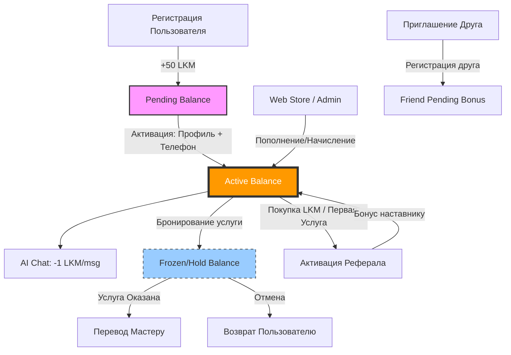

# Внутренняя валюта: Лакшмани (LKM)

Лакшмани (LKM) — это внутренняя расчетная единица экосистемы VedicAI (VedaMatch), предназначенная для оплаты сервисов, вознаграждения пользователей и обеспечения циркуляции ценности внутри приложения.

---

## 💎 Основные характеристики
- **Название:** Лакшмани (Lakshmani).
- **Код:** `LKM` (ранее LKS).
- **Курс:** 1 LKM ≈ 1 условная единица (базовый эквивалент локальной валюты, например, 1 рубль).
- **Природа:** Предзапланированный баланс (loyalty points / utility token), не является криптовалютой.

---

## 💰 Типы балансов
В системе используется трехуровневая структура счета пользователя:

1.  **Активный баланс (Active Balance):** Средства, доступные для немедленного использования.
2.  **Замороженный бонус (Pending Balance):** Бонусы, которые видны пользователю, но требуют "активации" (выполнения полезного действия) для перехода в активный баланс.
3.  **Hold баланс (Frozen Balance):** Средства, временно заблокированные под конкретную операцию (например, бронирование услуги до момента подтверждения).

---

## 🛠 Где и как работает (Сервисы)

### 1. AI Chat (Интеллектуальный помощник)
- **Условие:** Каждое сообщение в AI-комнатах (с включенным помощником) стоит **1 LKM**.
- **Механика:** Списание происходит мгновенно при отправке сообщения. Если баланс менее 1 LKM, система выдает ошибку 402 (Payment Required) и предлагает пополнить кошелек.

### 2. Marketplace & Booking (Услуги и Ятра)
- **Условие:** Оплата консультаций астрологов, записи на Ятру или покупка товаров.
- **Механика:** При бронировании сумма "холдируется" (переходит в Frozen). После подтверждения выполнения услуги мастером, средства переводятся на счет исполнителя. При отмене — возвращаются пользователю.
- **Комиссия на лиды:** Система может списывать фиксированную сумму (например, 50 LKM) с мастера за предоставление контакта клиента (модель оплаты за лид).

### 3. Реферальная система «Самбандха»
- **Условие:** Приглашение новых пользователей по личной ссылке или QR-коду.
- **Механика:** За каждого приглашенного друга начисляется бонус. Бонус падает в **Pending Balance**. Он становится **Active**, когда приглашенный друг совершает "активацию" (покупает пакет LKM или заказывает первую услугу).

### 4. Wallet (Кошелек)
- **Функции:** Просмотр истории транзакций, детальная информация по каждой операции, генерация графических чеков ("Поделиться чеком") для подтверждения оплаты мастерам в P2P режиме.

---

## 📈 Условия получения и использования

### Как получить LKM:
*   **Приветственный бонус:** 50 LKM начисляются в *Pending* при регистрации.
*   **Активация:** Перевод 50 LKM из *Pending* в *Active* происходит после заполнения профиля и подтверждения телефона.
*   **Рефералы:** Награда за развитие сообщества.
*   **Покупка:** (В будущем) Через внешний Web Store (pay.vedamatch.ru) для обхода комиссий магазинов приложений.
*   **Админ-начисление:** Администраторы могут начислять LKM за особые заслуги или в качестве компенсации.

### Правила списания и возврата:
*   **Идемпотентность:** Защита от двойного списания (повторный запрос с тем же ключом не спишет средства дважды).
*   **Возврат:** Возможен в течение 24 часов, если услуга в маркетплейсе не была оказана.
*   **Сгорание:** Бонусные LKM могут сгорать спустя 90 дней неактивности (стратегия удержания).
*   **Вывод средств:** В MVP-фазе вывод в фиатные деньги (рубли/доллары) недоступен для обычных пользователей (только для верифицированных бизнес-аккаунтов в будущем).

---

## 📊 Схема жизненного цикла LKM (Flow Diagram)

### 🎨 Визуальная экосистема (Infographic)

*Инфографика: Жизненный цикл «энергии» Лакшмани внутри приложения.*

---

## 🛡 Безопасность и контроль
Для обеспечения чистоты экономики администраторы имеют "God Mode" (Режим PRO) в админ-панели:
- Возможность вручную начислить или изъять LKM у любого пользователя с указанием причины.
- Полный аудит (Audit Trail) каждой транзакции: кто, кому, когда и за какой сервис перевел средства.
- Система флагов `Suspicious` для транзакций на крупные суммы.
