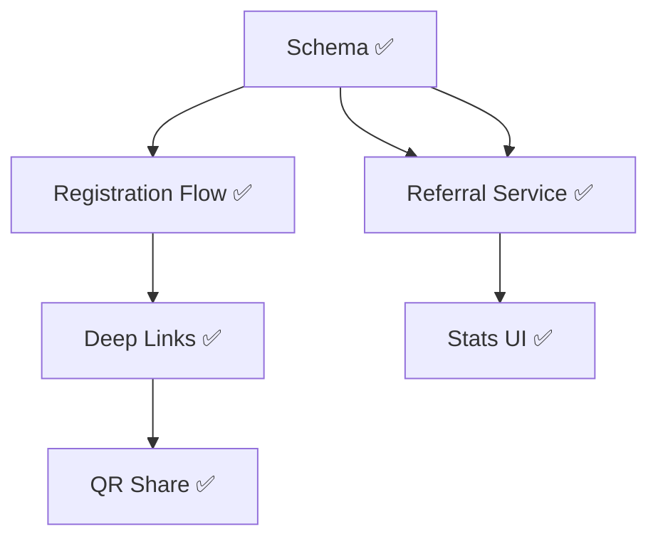

# План: Реферальная система «Самбандха» (Referral System MVP)

> **Статус:** ✅ Завершено (MVP)  
> **Дата обновления:** 2026-02-05  
> **Связанный документ:** [docs/monetization-lakshmani.md - Раздел 3](./monetization-lakshmani.md)

---

## 1. Обзор (Overview)

**Цель:** Реализовать систему роста базы пользователей через рекомендации.
**Механика:** Пользователи приглашают друзей, получают LKM за их "активацию" (полезные действия).
**Философия:** "Нет наград за регистрацию, есть награда за связь (Sambandha)".

---

## 2. Критерии успеха (Success Criteria)

| # | Критерий | Как проверить |
|---|----------|---------------|
| 1 | У каждого пользователя есть уникальный инвайт-код/ссылка | DB check: поле `invite_code` у всех юзеров |
| 2 | Новый юзер при регистрации связывается с пригласившим | DB check: поле `referrer_id` заполнено |
| 3 | Экран "Пригласить" отображает QR и статистику | UI check: Открыть профиль -> Пригласить друзей |
| 4 | При заполнении профиля рефералом начисляется 50 Pending LKM | Wallet check: баланс реферала вырос |
| 5 | При "Активации" (трата LKM) пригласивший получает 100 Active LKM | Wallet check: баланс пригласившего вырос |

---

## 3. Технологический стек

- **Backend:** Go + Fiber (User/Wallet Service).
- **Database:** PostgreSQL (Расширение `users` с полями referral).
- **Frontend:** React Native (Deep Links, Share API, QR Code).

---

## 4. Файловая структура

### Backend ✅
```
server/
├── internal/
│   ├── models/
│   │   └── user.go              # ✅ Добавлены поля InviteCode, ReferrerID, ReferralStatus
│   ├── services/
│   │   └── referral_service.go  # ✅ Логика начисления наград
│   └── handlers/
│       ├── auth_handler.go      # ✅ Интеграция invite_code при регистрации
│       └── referral_handler.go  # ✅ API: GetInviteLink, GetStats, GetReferrals
```

### Frontend ✅
```
frontend/
├── screens/
│   └── portal/referral/
│       └── InviteFriendsScreen.tsx  # ✅ Основной экран с QR, Share, Stats
├── App.tsx                          # ✅ Добавлен роут InviteFriends
└── types/navigation.ts              # ✅ Типизация навигации
```

---

## 5. Разбивка задач (Task Breakdown)

### Фаза 1: Backend & Data ✅

#### Task 1.1: Schema & Models ✅
- **Agent:** `backend-specialist`
- **Skill:** `database-design`
- **Output:**
    - ✅ Поле `invite_code` в `users` (генерируется автоматически).
    - ✅ Поле `referrer_id` в `users`.
    - ✅ Поле `referral_status` в `users` (pending/active).
    - ✅ Генерация кодов при регистрации.

#### Task 1.2: Registration Flow with Invite ✅
- **Agent:** `backend-specialist`
- **Skill:** `api-patterns`
- **Output:**
    - ✅ Обработка `invite_code` при регистрации.
    - ✅ Привязка `referrer_id`.
    - ✅ Генерация invite_code для нового пользователя.

#### Task 1.3: Referral Service (Rewards) ✅
- **Agent:** `backend-specialist`
- **Skill:** `clean-code`
- **Output:**
    - ✅ Метод `ProcessProfileCompletion(userID)` -> Начисление 50 Pending рефералу.
    - ✅ Метод `ProcessActivation(userID)` -> Начисление 100 Active пригласившему.
    - ✅ Интеграция с `WalletService.AddBonus()`.
    - ✅ API endpoints: `/referral/invite`, `/referral/stats`, `/referral/list`.

---

### Фаза 2: Frontend UI ✅

#### Task 2.1: Invite Screen Logic ✅
- **Agent:** `mobile-developer`
- **Skill:** `mobile-design`
- **Output:**
    - ✅ Получение Deep Link / Invite Code текущего юзера.
    - ✅ Экран InviteFriendsScreen с современным дизайном.

#### Task 2.2: QR & Share ✅
- **Agent:** `mobile-developer`
- **Skill:** `mobile-design`
- **Output:**
    - ✅ Генерация QR кода (библиотека `react-native-qrcode-svg`).
    - ✅ Кнопка "Поделиться" с Share API.
    - ✅ Копирование кода в буфер обмена.

#### Task 2.3: Referral List & Stats ✅
- **Agent:** `mobile-developer`
- **Skill:** `mobile-design`
- **Output:**
    - ✅ Список приглашенных с их статусом (Pending/Active).
    - ✅ Счетчик: приглашено, активных, заработано LKM.

---

### Фаза 3: Интеграция Deep Links ✅

#### Task 3.1: Deep Linking Configuration
- **Agent:** `mobile-developer`
- **Skill:** `app-builder`
- **Status:** ✅ Completed
- **Output:** Настройка `linking` в React Navigation для обработки ссылок вида `vedamatch://invite/{code}` и `vedamatch://portal/{tab}`.

---

## 6. График зависимостей



---

## 7. Риски
- **Фрод:** Накрутка рефералов (саморегистрация).
    - *Митигация:* Награда приглашающему ТОЛЬКО за "Активацию" (трату денег/услугу), а не просто за вход.

---

## 8. Реализованные файлы

### Backend
| Файл | Описание |
|------|----------|
| `server/internal/models/user.go` | Поля InviteCode, ReferrerID, ReferralStatus, Referrer |
| `server/internal/services/referral_service.go` | Полная логика реферальной программы |
| `server/internal/handlers/referral_handler.go` | API хендлеры |
| `server/internal/handlers/auth_handler.go` | Интеграция при регистрации |
| `server/cmd/api/main.go` | Роуты для /referral/* |

### Frontend
| Файл | Описание |
|------|----------|
| `frontend/screens/portal/referral/InviteFriendsScreen.tsx` | Экран приглашения друзей |
| `frontend/App.tsx` | Роут InviteFriends |
| `frontend/types/navigation.ts` | Тип навигации |

---

## ✅ MVP ЗАВЕРШЕН

## ✅ PHASE 2 ЗАВЕРШЕНА
1. **Universal Links:** Переход на `https://vedamatch.ru` с поддержкой Apple/Google App Site Association. ✅
2. **Push Notifications:** Уведомления о начислении бонусов и успехах друзей. ✅
3. **Analytics Dashboard:** Дашборд экономики и рефералов в админке. ✅
4. **Fraud Detection:** Защита по DeviceID (Fingerprinting) на бэкенде и фронтенде. ✅

---

## 🚀 PHASE 3: Виральность и UX (В работе)
1. **Social Sharing Pro:** Переход на `react-native-share` для нативного выбора мессенджеров (WA, TG) с кастомными превью.
2. **Invite Card Generator:** Генерация красивых имиджей (баннеров) для сторис/постов с QR-кодом пользователя.
3. **OpenGraph Support:** Настройка мета-тегов для ссылок `vedamatch.ru/invite/XXX` (красивое превью в Telegram/WhatsApp).
4. **Referral Progress:** Визуализация пути друга к "Активации" в списке рефералов.
