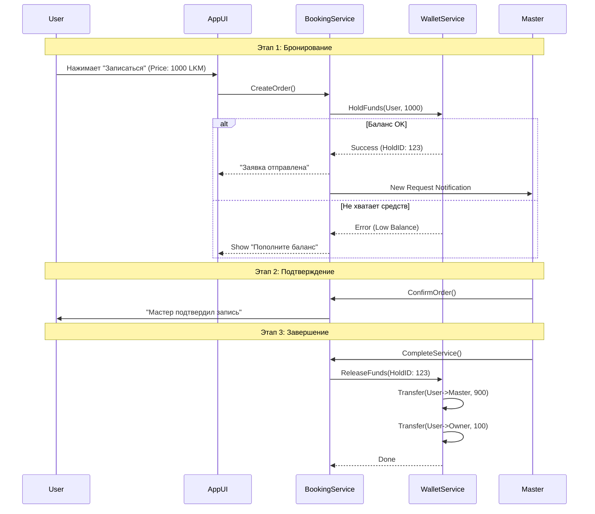
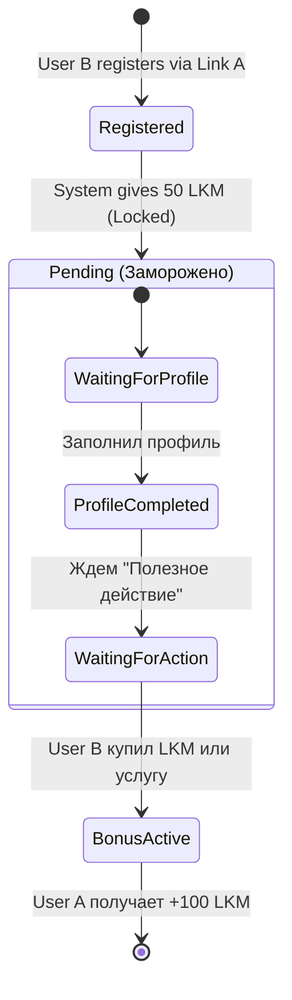

# Схема движения средств Lakshmani (LKM Flow)

> **Тип:** Архитектурная диаграмма  
> **Связь:** `monetization-lakshmani.md`

## 1. Общая схема циркуляции (Ecosystem Flow)

```mermaid
graph TD
    %% Участники
    User((Пользователь))
    Master((Мастер/Специалист))
    Fund((Фонд Сева))
    Owner((Владелец))

    %% Внешние системы
    WebStore[Web Store (Stripe/Bank)]
    WalletDB[(Единый Кошелек LKM)]
    
    %% Сервисы
    AI_Service[AI Астролог]
    Booking_Service[Бронирование Услуг]
    Media_Service[Медиа Контент]
    Charity_Service[Сева / Благотворительность]

    %% Потоки ввода денег
    User -- "1. Покупка (Fiat)" --> WebStore
    WebStore -- "2. Начисление (Webhook)" --> WalletDB
    
    %% Потоки трат (Расходы пользователя)
    WalletDB -- "3. Списание (1 LKM/msg)" --> AI_Service
    WalletDB -- "4. Hold (Заморозка)" --> Booking_Service
    WalletDB -- "5. Донат" --> Charity_Service
    
    %% Потоки доходов (Заработки Мастера)
    Booking_Service -- "6. Release (Разморозка после услуги)" --> Master
    
    %% Вывод и Комиссии
    AI_Service -.-> Owner
    Master -- "7. Комиссия (10%)" --> Owner
    Charity_Service -- "8. Tips (Чаевые)" --> Owner
    Charity_Service -- "9. Пожертвование (100%)" --> Fund
    
    %% Payouts
    Master -- "10. Запрос на вывод (Fiat)" --> Owner
```

---

## 2. Детальный поток транзакции услуги (Booking Transaction)



---

## 3. Реферальный поток (Referral Loop)


