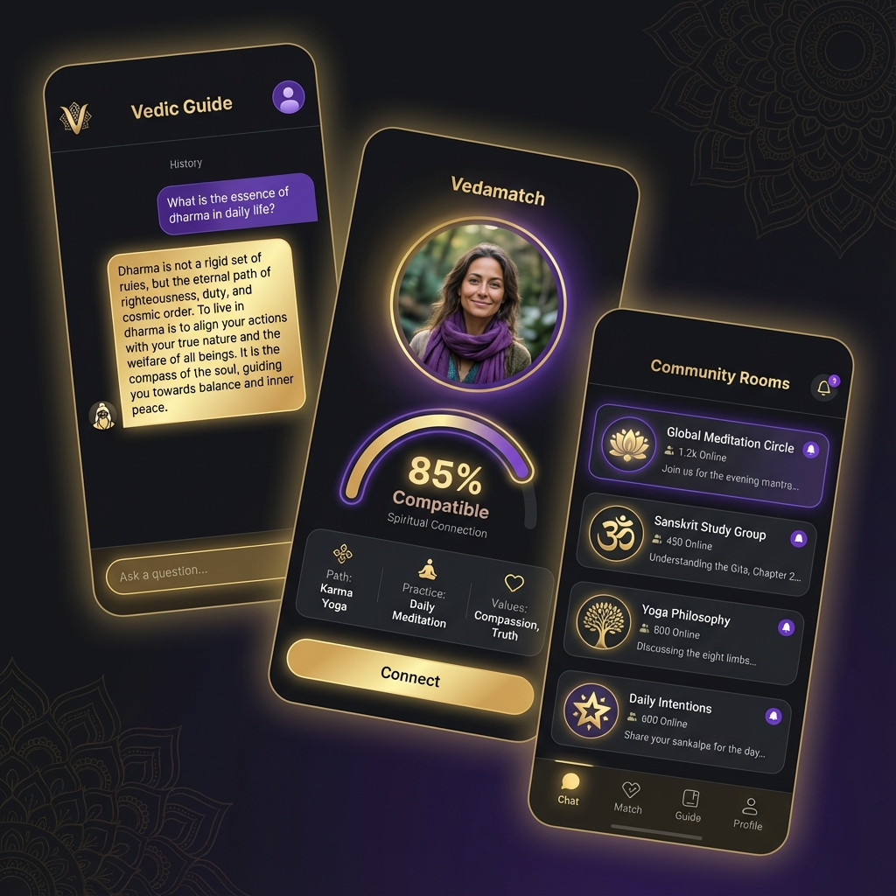

# Промпт для создания рекламного видео Vedic AI

**Роль:** Профессиональный видео-маркетолог и монтажер.

**Задача:** Создать красивое, вдохновляющее видео (рекламный ролик), демонстрирующее, как преданные используют приложение **Vedic AI** в своей повседневной жизни. Видео должно вызывать чувство покоя, связи с общиной и технологического удобства.

**Целевая аудитория:** Люди, интересующиеся ведической культурой, духовным развитием, йогой, а также преданные, ищущие общения и пару.

**Стиль и Настроение:**
*   **Эстетика:** Премиальная, современная, но с глубоким духовным подтекстом.
*   **Цвета:** Глубокий фиолетовый, золотой, теплые оттенки рассвета.
*   **Атмосфера:** Умиротворение, радость общения, надежда, мудрость.

**Референсное изображение интерфейса:**
Используйте это изображение для вставки экранов приложения в видео (мокапы):

---

## Сценарий видео (Покадровая структура)

### Сцена 1: Утро и Настройка (0:00 - 0:05)
*   **Визуал:** Снято мягко, солнечные лучи падают на стол. Рука берет смартфон. На экране открывается приложение **Vedic AI**.
*   **Действие:** Пользователь открывает "Vedic Guide" (Chat) и получает "Мудрость дня".
*   **Текст на экране:** "Начни день с мудрости."
*   **Интерфейс:** Показывается экран чата с красивой цитатой (как на референсе).

### Сцена 2: Духовное общение (0:05 - 0:12)
*   **Визуал:** Человек едет в транспорте или сидит в парке, улыбается, глядя в телефон.
*   **Действие:** Переход в раздел "Комнаты" (Community Rooms). Видно активное обсуждение в комнате "Global Meditation Circle". Пользователь отправляет сообщение поддержки.
*   **Текст на экране:** "Община всегда с тобой."
*   **Интерфейс:** Экран списка комнат с аватарами и названиями тем.

### Сцена 3: Поиск родственной души (Vedamatch) (0:12 - 0:20)
*   **Визуал:** Вечер, уютная обстановка. Молодой человек или девушка с надеждой смотрит в телефон.
*   **Действие:** Свайп в разделе **Vedamatch** (Знакомства). Появляется профиль с высокой совместимостью (85% Compatible). Видны общие духовные интересы: "Bhakti Yoga", "Vegetarian". Кнопка "Connect" нажимается.
*   **Текст на экране:** "Найди тех, кто разделяет твой путь."
*   **Интерфейс:** Карточка профиля dating-раздела с индикатором совместимости.

### Сцена 4: Итоговая заставка (0:20 - 0:25)
*   **Визуал:** Коллаж из счастливых лиц пользователей, переходящий в логотип приложения **Vedic AI**.
*   **Текст на экране:** "Vedic AI: Технологии для души. Скачай сейчас."
*   **Аудио:** Завершающий легкий звон колокольчиков или мантра на фоне современной эмбиент-музыки.

---

**Технические требования к генерации видео:**
*   **Формат:** 9:16 (для Reels/Shorts) или 16:9 (для YouTube), в зависимости от платформы.
*   Ensure smooth transitions between "real life" footage and UI close-ups.
*   Use the provided `app_showcase.png` to realistically composite the screens onto the phones in the video.
